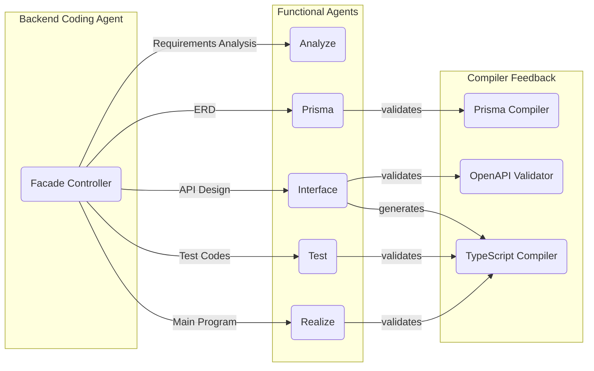

# Embed-prisma

[](https://github.com/samchon/embed-prisma/blob/master/LICENSE)
[](https://www.npmjs.com/package/embed-prisma)
[](https://www.npmjs.com/package/embed-prisma)
[](https://github.com/samchon/embed-prisma/actions?query=workflow%3Abuild)
[](https://discord.gg/E94XhzrUCZ)

A library that exposes Prisma's compiler API for NodeJS applications.

It enables programmatic schema compilation without requiring the Prisma CLI.

Note that, `embed-prisma` works only on NodeJS environment. It does not work on Browser.

## Features

- **Schema Validation**: Programmatically validate Prisma schema files
- **Type Definitions**: Generate TypeScript definitions for Prisma Client
- **Documentation:** Create comprehensive Markdown documentation from your data model
- **Visualizations:** Produce Entity Relationship Diagrams in mermaid format
- **Error Handling**: Get detailed feedback on schema issues with comprehensive error reporting
- **No CLI Dependency**: Perform all operations directly from your code without Prisma CLI

## Installation

```bash
npm install embed-prisma
```

## User Guides

```typescript
import { EmbedPrisma, IEmbedPrismaResult } from "embed-prisma";

const prisma: EmbedPrisma = new EmbedPrisma();
const result: IEmbedPrismaResult = await prisma.compile({
  "actors.prisma": "[PRISMA SCHEMA FILE CONTENT]",
  "products.prisma": "[ALLOWS MULTIPLE SCHEMA FILES]",
  "orders.prisma": "[...]",
});
if (result.type === "success") {
  console.log(
    result.nodeModules, // "node_modules/.prisma/client" generated by Prisma
    result.document, // Documentation by "prisma-markdown"
    result.diagrams, // Entity Relationship Diagrams
  );
} else if (result.type === "failure") {
  console.log(result.reason); // Compile error message from Prisma
}
```

The library supports compilation of both single and multiple Prisma schema files.

It handles all aspects of the compilation process including validation, TypeScript definition generation, documentation creation, and error reporting.

The returned `IEmbedPrismaResult` object is a discriminated union with three possible types:

- `IEmbedPrismaResult.ISuccess`: Contains all generated artifacts when compilation succeeds
- `IEmbedPrismaResult.IFailure`: Contains detailed error messages when schema validation fails
- `IEmbedPrismaResult.IException`: Contains exception information when unexpected errors occur

All generated artifacts can be directly used in your application or written to disk for further processing.

## Real-World Applications



[`AutoBE`](https://github.com/wrtnlabs/autobe), an AI vibe coding agent of backend server.

It makes NestJS/Prisma stacked backend application, and [`embed-typescript-compiler`](https://github.com/samchon/embed-typescript-compiler) together with `embed-prisma` are utilized for compiler feedback strategy, correcting AI's programming language level mistakes.

The compiler feedback approach is particularly powerful for:

- Validating AI-generated schemas immediately without manual intervention
- Providing precise error messages to help AI correct its own mistakes
- Generating accurate documentation and visualizations from validated schemas
- Creating type-safe client interfaces that ensure consistent API usage

Beyond AI applications, `embed-prisma` is valuable for development tools, build pipelines, and any application that needs to validate or process Prisma schemas programmatically.